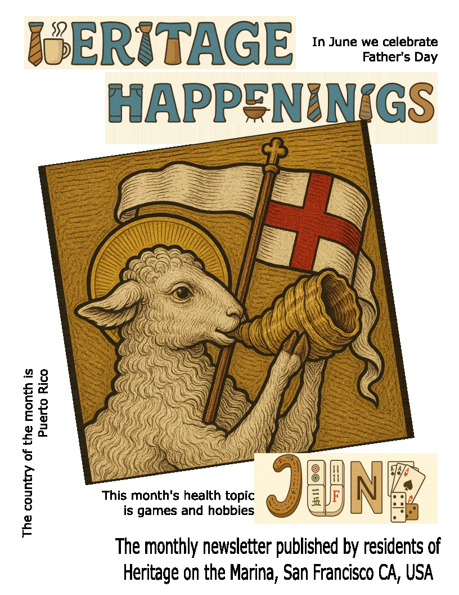

# Heritage Happenings ~ June
Hello Residents

Here is the "Front Page" of the June issue of _Heritage Happenings_

I'm sorry it's taken so long to get this issue out.  I hope to do better in July.

This issue is the beginning of a new way of publishing the _Heritage Happenings_. Past issues focus on publishing on printed paper. Future issues will focus more on delivery by email and by the Internet.

Articles will be sent out one at a time as individual emails or blog posts on the web. Each article will be fairly short — just a page or two of text and longer if it includes photos.

I hope we are able to publish several articles a week. I hope to get Jane Standing's article on traveling across America out in the next day or so.

The benefits of publishing for the web will allow the inclusion of links, photo albums, videos and more.

Also I hope we can be more timely. It would be nice to highlight special events in the coming week or share photos of an event that just happened.

Every article we publish will also be available as a PDF file. This will mean that articles can be printed out to paper quite easily.

I'm sure there wil be some surprises ~ some nice and some not so nice. I look forward to your feedback and suggestions.

Cheers,

Theo
