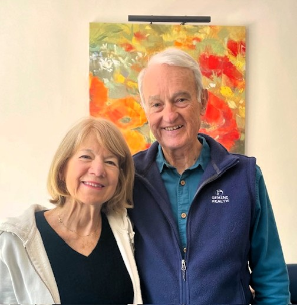

# Introducing Candy and Jim Naughton

_By Martha Nell Beatty with Candy Naughton_

Candy and Jim met in the sixth grade in Cherry Hill, NJ, started dating in their junior year in high school, and married after graduating college. They did go their separate ways for college, however. Candy studied at Juniata College in Pennsylvania, spending her Junior Year Abroad at the Universidad de Valencia in Valencia, Spain. Jim attended Dartmouth College and Harvard for undergraduate and medical school.

Moving to Dartmouth College in Hanover, NH, Jim started Medical School while Candy taught English, French & Spanish to grades 7-9 in Canaan, NH. Surprisingly, a terrible ski accident occurred — leaving her leg broken and in a wheelchair. It was an incredible teaching experience as the students had to do everything in the classroom. For 7th grade English they needed to put graphics of the books they had read, essays, and everything on the bulletin boards all around the classroom. All were eager to help and amazingly thoughtful. The end of the lunch hour was noted in the teacher's room by the students arguing out in the hallway over whose turn it was to push the wheelchair. It was a high point in a 30-year career of teaching.

In 1972 Jim graduated from Harvard Medical School and was offered an Internship at UCSF. Given a week to finish grading Spanish exams and head West, they enjoyed the hurried trip across the country—one would drive and the other read "Bury My Heart at Wounded Knee" to stay awake. Looking forward to seeing the city of San Francisco, Candy exclaimed as they started to cross the Sierra Nevada, "This looks just like Spain!" Maybe this would be home.

Jim took longer to be convinced, enjoying the seasons in the East and a sense of permanence.

For three years of his basic residency in Internal Medicine, Jim rotated through Moffitt/Long Hospital, the VA Hospital, and San Francisco General. He was then selected to do another year as Chief Resident, choosing to do it at SF General Hospital. After a nephrology fellowship he joined the faculty at UCSF as Assistant Chief of Medicine and Director of the residency program in internal medicine.

In the early 1980s Jim joined a medical group in the East Bay with an office in Pinole. Jim was an Internist as well as Nephrologist, while his partners had different specialties. The doctors were also Hospitalists who were able to visit their own patients in the hospital. That model changed, however, because most hospitals have their own hospitalists on staff so doctors cannot follow up with their own patients in the hospital.

Candy was Spanish Department head at Drew School, a private coed school on California and Broderick since 1908. During this time she obtained her master's degree in Spanish Language and Linguistics from San Francisco State.

The Naughtons lived in the City with their daughter and son, but after the earthquake in 1989, they decided to build a home in Sausalito. The commute for Jim was about the same to the East Bay. When they lived in Marin, Candy taught Spanish for adults at Tam Evening School.

Monday mornings Jim starts the week in a beautiful and peaceful setting in Muir Woods, where he is part of a volunteer group to "fix the park." They repair fences, cut branches, making visitor safety the central issue.

Both Candy and Jim are San Francisco City Guides. Their tour is the Golden Gate Bridge. They meet visitors near the Strauss statue in the Plaza, discussing the history, architecture, Art Deco design, and engineering. Emphasis is on the impossibility of building a bridge, the currents, maintenance, color, and fog.

After visiting a number of senior facilities, the Naughtons chose Heritage on the Marina. Candy especially liked that it was "authentic." From their living room window they can see the Sausalito hillside where they lived and they are very happy to be at Heritage on the Marina.

 

## Nephrology

Nephrologists are medical doctors who specialize in diagnosing and managing kidney disease, including monitoring how other chronic conditions, such as diabetes and high blood pressure, affect the kidneys. Nephrologists typically do not perform surgery.

## Hospitalist

A hospitalist is a physician specializing in the care of hospitalized patients. They focus on managing and treating a wide range of medical conditions within a hospital setting, from admission to discharge. Hospitalists often have backgrounds in internal medicine, pediatrics, or family medicine.
