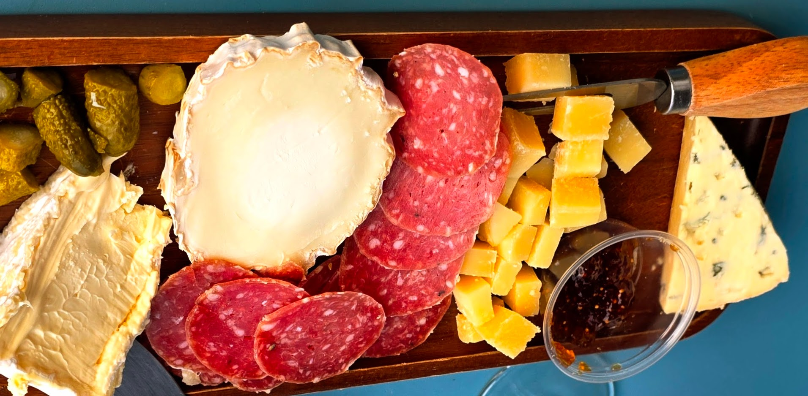

# French Wine and-Cheese Tasting

* Wednesday, July 16 at 3:00 in Friendship Hall

**Special Bonus!!** Your $20 donations will be your donations to the Employee Appreciation Fund!

**Guest Speaker** Dylan Dylan, founder and owner of La Fromagerie on Cheesnut Street will stop by arounfd 3:15 to talk about the pairings and answer your questions.

## Appetizer ~ Bubbles and Cream

We jump in with sparkling wine and an extra creamy cheese

### Wine with Fine Bubbles: Vouvray ~ Pétillant Brut ~ Blanc de Chenin ~ Domain Gaudron

Winemaker: Gilles Gaudron ~ Wine Region: Loire Valley ~ Variety: 100% Chenin

With its crisp acidity, complex, biscuity character and fine, persistent bubbles, this sparkling Chenin Blanc makes a great alternative to Champagne.

### Triple Creamy Cheese: Brillât-Savarin ~ _crémeux_ / triple cream

Brillat-Savarin is a soft-ripened triple cream cow's milk cheese that is luscious, creamy and faintly sour. It has a natural, bloomy rind. It was created in 1890 as "Excelsior" or "Délice des gourmets" ("Gourmets' delight") by the Dubuc family. Brillat-Savarin is produced all year round mainly in Burgundy.

Father and son cheesemakers Pierre and Henri Androuët renamed it in the 1930s, as an homage to 18th-century French gourmet and political figure Jean Anthelme Brillat-Savarin.

## First Course ~ White and Light

We start to dig in with a robust white wine paired with a mild tasting cheese

### White Wine: Domaine la Genestière ~ Viognier ~ 2022 ~ ~ Pays D'Oc ~ "Les Petits Cailloux"

Wine of the Month Club says this:
The 2022 Château la Genestière Les Petits Cailloux Viognier Pays d’Oc had us on the first sniff. “What a gorgeous nose!” uttered one tasting panel member. “This wine smells so good it’s almost a shame to drink it,” commented another. In true Viognier fashion, the aroma alone of this Les Petits Cailloux Viognier is worth the price of admission. Pure juicy peach and apricot aromas waft from the glass. Add a spray of spring flowers and the bouquet on this wine is nothing short of mildly intoxicating. In the mouth, the wine’s fruit and floral tones meld with fresh acidity and gentle mineral tones, delivering considerable palate pleasing pleasure. Stylish and utterly charming, Château la Genestière’s 2022 Les Petits Cailloux Viognier exits with grace, leaving all of us begging for more. Textured and pleasantly dry, it’s hard to ask more of this lovely Viognier.

### Goat's Milk Cheese: Bucherondin

Bûcheron or Bucherondin is a goat's milk cheese native to the Loire Valley in France. Semi-aged, ripening for 5 to 10 weeks, Bucheron is produced as short logs that weigh 3 to 4 pounds that are sliced and sold as small rounds in food stores.

Bûcheron has an ivory-colored pâte surrounded by a bloomy white rind. Soft, but semi-firm in texture, this cheese when young has a mild taste and it has a harder texture. As it ages, is gets a softer texture and a sharper, more intense taste. It is a good cheese for salads or for snacking with hearty grained breads, crackers, grapes and fresh figs.

## Main Course ~ Red and Firm

The main course is a hearty red with a firm tangy cheese from the Alps

### Red Wine: Châteauneuf-du-Pape ~ 2022

* https://en.wikipedia.org/wiki/Ch%C3%A2teauneuf-du-Pape_AOC

Châteauneuf-du-Pape (French pronunciation: [ʃɑtonœf dy pap] ⓘ) is a French wine, an Appellation d'origine contrôlée (AOC) located around the village of Châteauneuf-du-Pape in the Rhône wine region in southeastern France. It is one of the most renowned appellations of the southern part of the Rhône Valley, and its vineyards are located around Châteauneuf-du-Pape and in neighboring villages, Bédarrides, Courthézon and Sorgues, between Avignon and Orange. They cover slightly more than 3,200 hectares or 7,900 acres (32 km2) and produce over 110,000 hectolitres of wine a year,[1] more wine made in this one area of the southern Rhône than in all of the northern Rhône.[2]

The wines have traditionally been packaged in distinctive heavy dark wine bottles embossed with papal regalia and insignia. However, in recent times a number of producers have dropped the full papal seal in favour of a more generic icon, while still retaining the same heavy glassware.

Châteauneuf-du-Pape red wines are often described as earthy with gamey flavors that have hints of tar and leather.[4] The wines are considered tough and tannic in their youth but maintain their rich spiciness as they age.[1] The wines often exhibit aromas of dried herbs common in Provence under the name of garrigue. Châteauneuf-du-Pape dominated by Mourvèdre tend to be higher in tannin and requiring longer cellaring before being approachable.[3]

### Firm Cheese: Beaufort ~ _vache_ / cows milk cheese

## Desert: Sweet and Spicy

The finale mixes a traditional mellow desert wine with a light but exotic blue cheese

### Desert Wine: Chateau Grand-Jauga ~ Sauternes ~ 2018

### Exotic Cheese: Bleu d Auvergne
