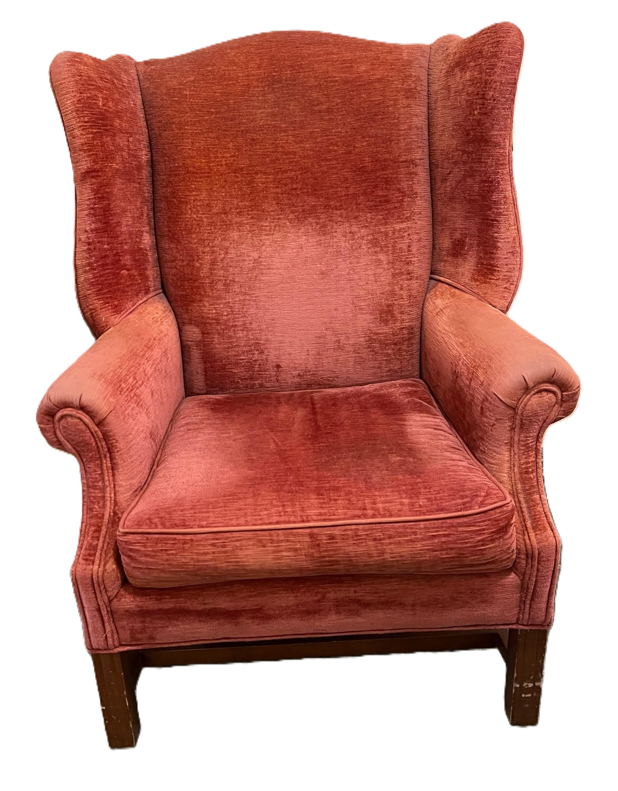

## Ode to The Red Chair

By Jane Standing

I leave my apartment with Jonathan to walk slowly to the end of the corridor. My goal is The Red Chair. I sink gratefully into it with its open arms and welcoming wings. Where next? To the garden [Oh bliss] or to the flowers filled balcony overlooking Francisco Street or just to lunch. Either way I am reluctant to leave your faded plush.

The Red Chair has become my friend. I wonder about its past. It must have been glorious when new. I still think its glorious but now it is like a well loved teddy bear a bit threadbare around the arms. Other people sit in it of course. Do they feel about it the way I do? It has a mate at the other end of the table but it is not as popular because The Red Chair has an uninterrupted view down two corridors so that you can see all the “comings and goings.”

Red Chair, don’t ever let them move you to another location. I would be quite bereft. And we would all miss your cozy charm. Don’t let them replace you with something more up-to-date.

Love,

Jane

## Addendum

By Theo

Jane is not alone in her affection for The Red Chair. I have noticed that many people gravitate to it — including myself. On Tuesday mornings, I sit in The Red Chair after breakfast while Leonore finishes her weekly efforts to keep my apartment clean and tidy.

Tony reads the newspaper on the table while waiting for Linda to come down. June sits in The Red Chair while she waits for the elevator to arrive.

What about The **Other** Red Chair? I have noticed that Kay will sometimes choose it instead, as her concentration is so intense that she may prefer to avoid the distractions of comings and goings in the corridor.

I find observations like Jane's remarkable. They reveal how attached we can become to inanimate objects — and more deeply, they express gratitude for the small pleasures in life.

And so, to The Red Chair, I say thank you for being there for us!
