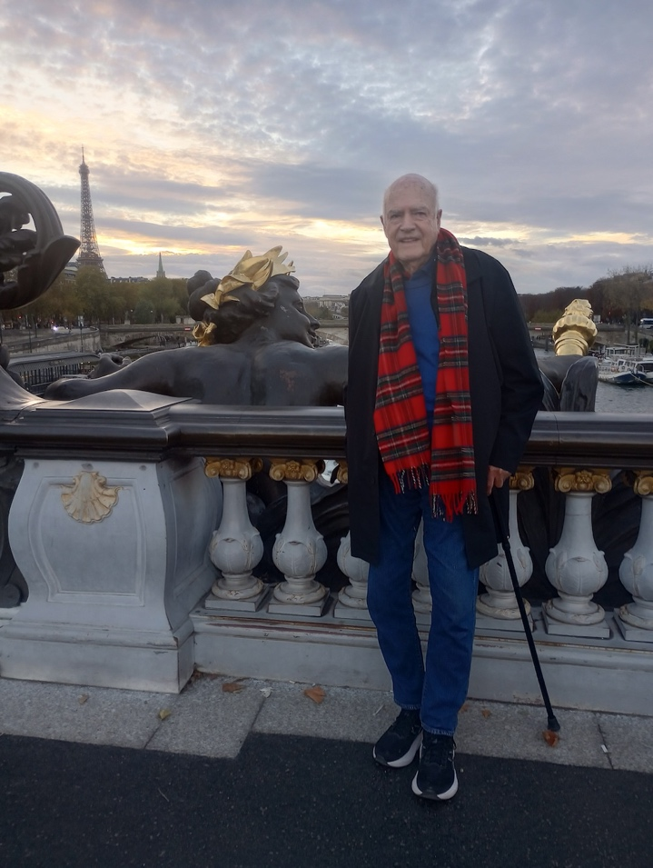
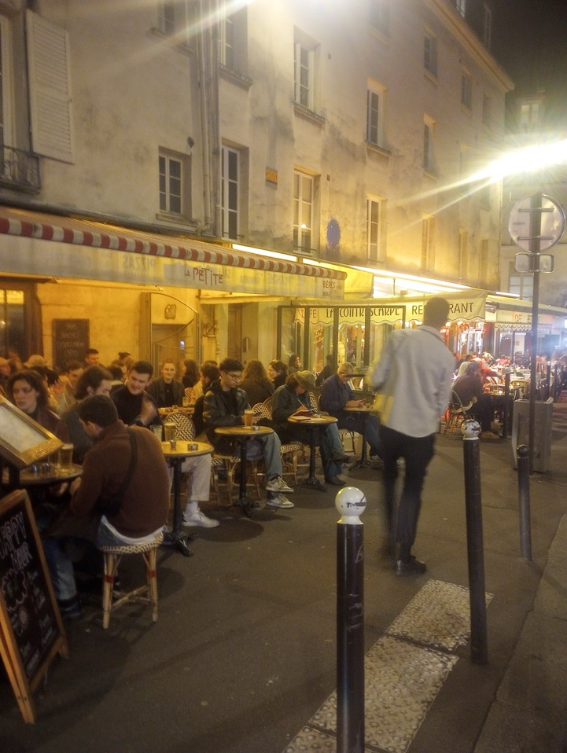
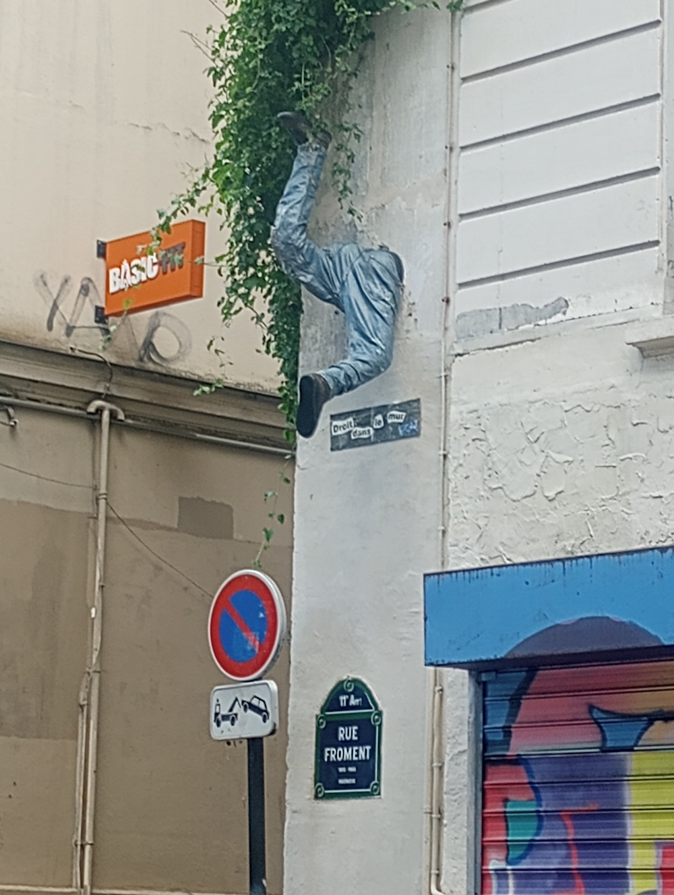
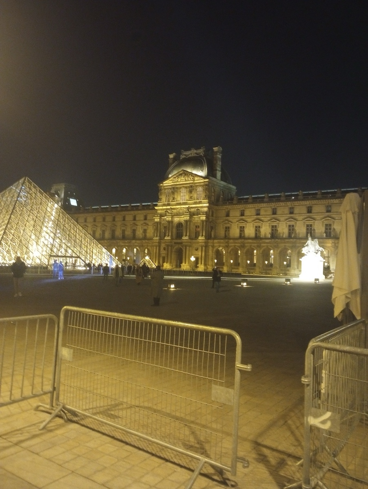
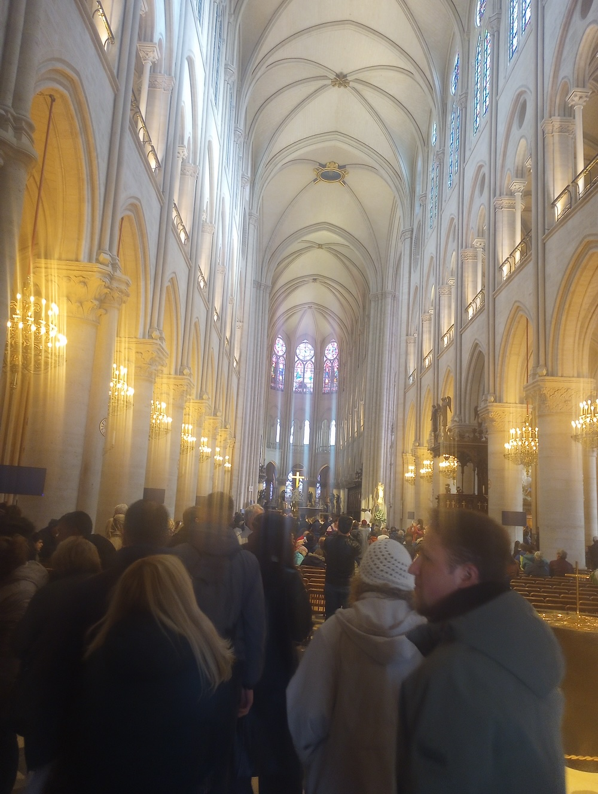
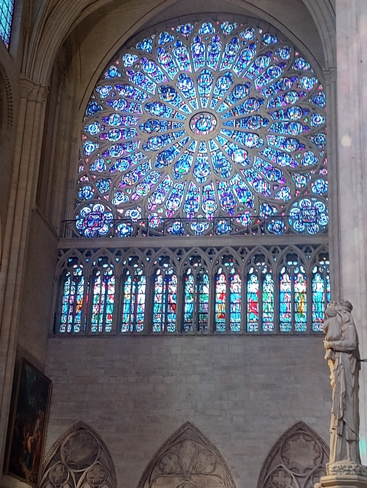
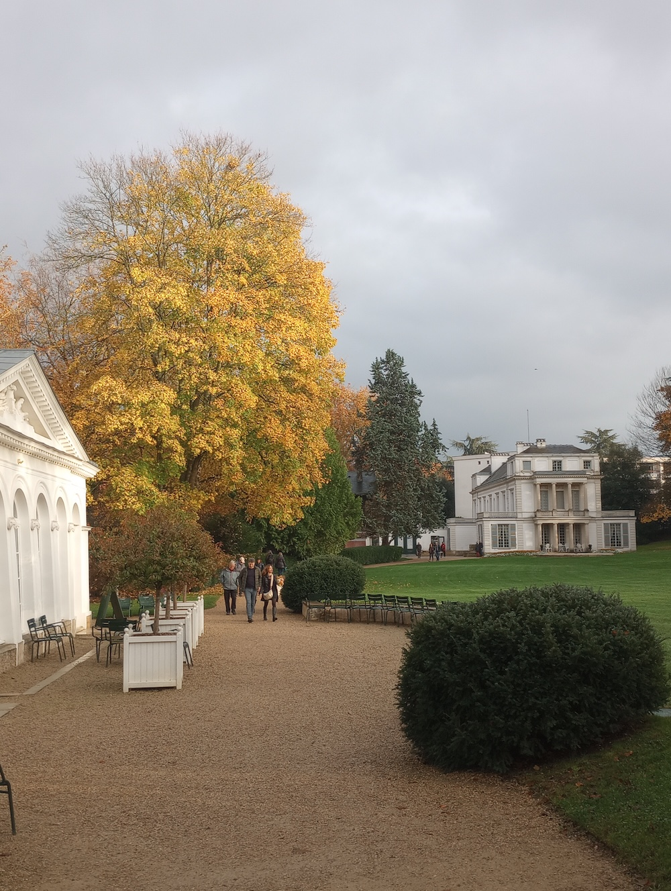
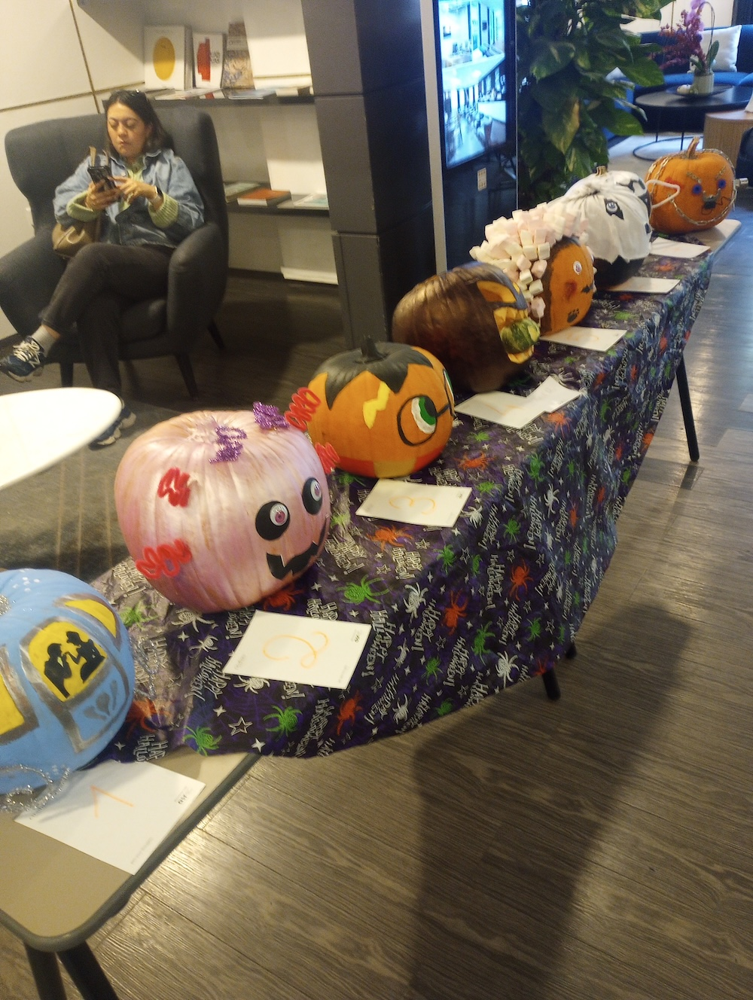

**Dateline Paris 2025**

**Scenes from Paris**

****

Your correspondent on the Pont Alexandre 111 Bridge which crosses the Seine.

Café Scene in Paris

On the Rue Froment – in the 11th Arrondissement

Some guy got stuck

The Louvre at Night

Notre Dame Cathedral-The Nave.

The Cathedral is now open to the public. It has been completely cleaned up from the fire and several hundred years of dirt from candles and dust.

Notre Dame-stained glass Window. This has been beautifully restored.

The Caillebotte House about a half hour’s train ride from Paris.

The Staff at the Hotel had a pumpkin competition with a prize for the best designed pumpkin. Part of Halloween celebration.

Best Wishes to all at the Heritage

Patrick
